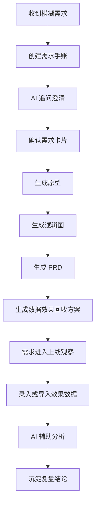
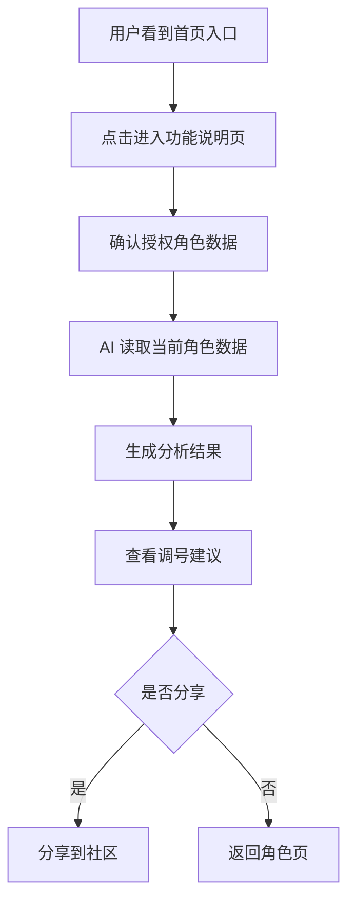
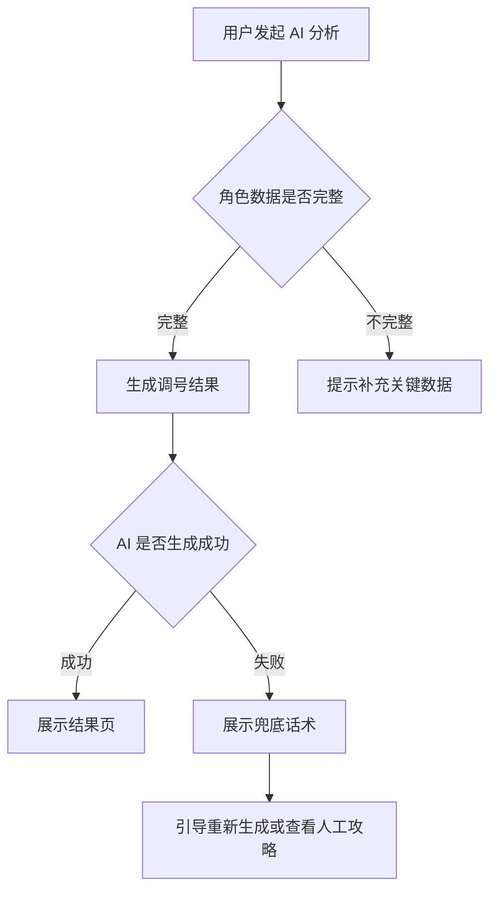
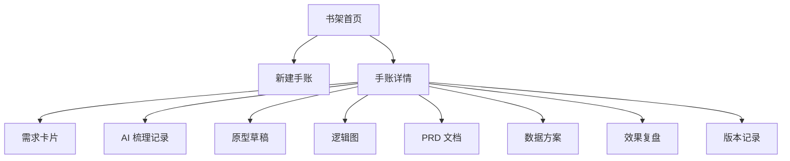
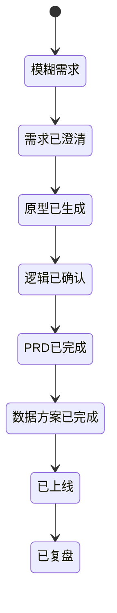

# 产品需求手账 Demo：需求全生命周期 AI 工作台

## 1. 产品一句话定位

**产品需求手账**是一个面向产品经理的 AI 需求协作平台，将一个模糊需求从“收到一句话”开始，经过 AI 追问澄清、原型生成、逻辑图生成、PRD 生成、数据回收方案生成、上线后效果分析，最终沉淀为一本可翻阅、可复盘、可复用的“需求手账”。

平台首页以“书架”为核心隐喻：**一本手账 = 一个需求项目**。用户进入某本手账后，可以看到该需求从想法到复盘的完整过程。

---

## 2. 背景与问题

### 2.1 当前产品经理工作中的典型问题

产品经理在处理需求时，常见链路是：

1. 业务方提出一个模糊诉求；
2. PM 反复追问背景、目标、边界；
3. 输出原型、流程图、需求文档；
4. 补充数据埋点和效果回收方案；
5. 上线后拿数据做复盘；
6. 相关材料散落在聊天记录、文档、原型工具、数据报表中。

核心问题不是“不会写 PRD”，而是：

| 问题 | 具体表现 |
|---|---|
| 需求信息碎片化 | 背景、讨论、决策、方案、数据分散在多个工具 |
| 模糊需求难以结构化 | 业务方一句话需求，经常缺少目标、用户、场景、验收标准 |
| AI 使用不连续 | AI 可以辅助写文档，但很难沉淀成完整需求资产 |
| 复盘链路断裂 | 很多需求上线后没有持续跟踪数据，无法证明效果 |
| 历史需求难复用 | 类似需求来了之后，难以快速参考旧方案、旧逻辑、旧数据 |

### 2.2 Demo 要解决的核心问题

本 demo 不是做一个普通的文档工具，而是验证一个产品概念：

> AI 是否可以陪伴 PM 完成一个需求从“模糊输入”到“数据复盘”的完整生命周期，并将过程沉淀为可查阅、可复用的产品资产。

---

## 3. 目标用户

### 3.1 核心用户

| 用户角色 | 需求 |
|---|---|
| 产品经理 | 梳理需求、生成方案、沉淀过程、复盘效果 |
| 业务运营 | 提交需求、确认目标、查看方案和数据 |
| 研发/测试 | 查看逻辑图、边界规则、验收标准 |
| 产品负责人 | 查看需求进展、质量、优先级和效果 |

### 3.2 Demo 优先服务对象

本 demo 优先面向 **产品经理个人工作流**，强调“一个 PM 如何用 AI 把需求做完整”。

---

## 4. 产品核心概念

### 4.1 书架

书架是平台首页，展示所有需求手账。

每本手账代表一个需求项目，封面显示：

- 需求名称
- 当前阶段
- 优先级
- 负责人
- 最近更新时间
- AI 完成度评分
- 上线效果状态

### 4.2 手账

一本手账由多个章节组成：

| 章节 | 内容 |
|---|---|
| 需求卡片 | 原始需求、背景、目标、范围、优先级 |
| AI 梳理记录 | AI 与 PM 的追问、补充、确认过程 |
| 原型草稿 | 页面结构、低保真原型、交互说明 |
| 逻辑图 | 用户流程、业务流程、状态流转、异常分支 |
| 需求文档 | PRD、字段、规则、验收标准 |
| 数据方案 | 埋点、指标、看板、效果回收口径 |
| 上线复盘 | 数据表现、目标达成、问题分析、优化建议 |

### 4.3 AI 助手

AI 不是单纯的聊天机器人，而是需求推进助手，按阶段提供不同能力：

| 阶段 | AI 能力 |
|---|---|
| 需求输入 | 识别模糊点、自动追问 |
| 需求澄清 | 补齐用户、场景、目标、边界 |
| 方案设计 | 生成方案结构、页面清单 |
| 原型阶段 | 生成低保真页面草图说明 |
| 逻辑阶段 | 生成流程图、状态机、泳道图 |
| PRD 阶段 | 生成结构化需求文档 |
| 数据阶段 | 生成埋点和效果回收方案 |
| 复盘阶段 | 分析数据、输出结论和下一步建议 |

---

## 5. Demo 核心流程

### 5.1 总体流程

### 5.2 用户操作路径

1. 用户进入平台首页；
2. 点击“新建手账”；
3. 输入一句模糊需求，例如：  
   “我想做一个 AI 功能，帮用户更快完成角色养成建议。”
4. AI 自动识别缺失信息；
5. AI 分批追问：
   - 目标用户是谁？
   - 解决什么问题？
   - 入口在哪里？
   - 输出什么结果？
   - 成功标准是什么？
   - 是否需要数据回收？
6. 用户回答后，AI 生成需求卡片；
7. 用户点击“生成原型”；
8. AI 输出页面清单和低保真原型；
9. 用户点击“生成逻辑图”；
10. AI 输出业务流程图、页面流转图、异常逻辑；
11. 用户点击“生成 PRD”；
12. AI 输出完整需求文档；
13. 用户点击“生成数据方案”；
14. AI 输出指标、埋点、看板和复盘模板；
15. 上线后用户录入数据；
16. AI 分析效果，输出复盘结论；
17. 整个过程自动沉淀为一本完整手账。

---

## 6. 功能模块设计

## 6.1 书架首页

### 页面目标

让用户快速看到所有需求项目的状态，并进入某一本手账。

### 页面元素

| 模块 | 内容 |
|---|---|
| 顶部导航 | 产品名称、搜索框、新建手账按钮 |
| 筛选区 | 全部、梳理中、设计中、开发中、已上线、已复盘 |
| 书架区域 | 以书本卡片形式展示需求 |
| 右侧概览 | 本周新增需求、待补充信息、待复盘需求 |
| AI 快捷入口 | 输入一句话直接创建手账 |

### 书本卡片字段

| 字段 | 示例 |
|---|---|
| 需求名称 | AI 调号台入口优化 |
| 当前阶段 | 原型设计中 |
| 优先级 | P1 |
| 完成度 | 65% |
| 风险提示 | 缺少验收指标 |
| 更新时间 | 2026-05-29 |

### 关键交互

- 点击书本：进入手账详情页；
- 点击“新建手账”：打开需求输入弹窗；
- 输入一句话需求：自动创建手账并进入 AI 梳理页；
- 筛选状态：切换不同阶段的需求。

---

## 6.2 新建手账

### 页面目标

支持用户用极低成本输入一个模糊需求。

### 输入方式

| 输入方式 | 说明 |
|---|---|
| 一句话输入 | 输入最原始的需求想法 |
| 粘贴聊天记录 | 粘贴业务方、老板、运营的原始描述 |
| 上传材料 | 可上传截图、文档、表格 |
| 选择模板 | 活动需求、功能需求、数据需求、后台需求 |

### AI 初步识别

AI 创建手账后，自动生成：

| 内容 | 示例 |
|---|---|
| 需求类型 | C 端功能需求 |
| 可能目标 | 提升用户理解效率 |
| 缺失信息 | 用户场景、入口、核心指标、验收标准 |
| 推荐下一步 | 进入需求澄清 |

---

## 6.3 AI 需求梳理页

### 页面目标

通过 AI 追问，把模糊需求压成结构化需求卡片。

### 页面布局

| 区域 | 内容 |
|---|---|
| 左侧 | 原始需求、AI 识别的问题列表 |
| 中间 | AI 对话区 |
| 右侧 | 实时生成的需求卡片 |

### AI 追问逻辑

AI 不应一次性问十几个问题，而是分阶段追问：

#### 第一轮：确认需求本质

- 这个需求主要服务谁？
- 用户遇到的具体问题是什么？
- 这个需求是新增能力、体验优化，还是运营工具？

#### 第二轮：确认使用场景

- 用户在什么页面或流程里触发？
- 触发前用户已经完成了什么动作？
- 触发后用户希望得到什么结果？

#### 第三轮：确认方案边界

- 首期必须做什么？
- 哪些可以不做？
- 是否存在权限、频控、异常兜底？

#### 第四轮：确认成功标准

- 上线后看什么指标？
- 是否有目标值？
- 数据从哪里来？

### 输出：需求卡片

| 字段 | 说明 |
|---|---|
| 需求名称 | AI 自动命名，可编辑 |
| 需求背景 | 为什么要做 |
| 用户问题 | 用户当前痛点 |
| 目标用户 | 谁使用 |
| 核心目标 | 希望达成什么 |
| 功能范围 | 首期做什么 |
| 非目标 | 首期不做什么 |
| 验收标准 | 怎么判断做完 |
| 风险点 | AI 自动识别 |
| 待确认项 | 仍未明确的问题 |

---

## 6.4 原型生成页

### 页面目标

基于需求卡片生成低保真原型，帮助 PM 快速表达页面结构。

### 原型输出内容

| 类型 | 内容 |
|---|---|
| 页面清单 | 本需求涉及哪些页面 |
| 页面结构 | 每个页面包含哪些模块 |
| 操作路径 | 用户从哪里进入、如何完成操作 |
| 低保真原型 | 用线框图展示页面布局 |
| 交互说明 | 点击、弹窗、跳转、状态变化 |

### 示例页面清单

以“AI 调号台需求”为例：

| 页面 | 说明 |
|---|---|
| 首页入口 | 展示 AI 功能入口 banner |
| 功能说明页 | 解释 AI 能做什么 |
| 数据授权页 | 告知需要读取角色数据 |
| AI 分析中页 | 展示生成进度 |
| 调号结果页 | 输出阵容建议、养成优先级 |
| 分享页 | 支持将结果分享到社区 |
| 异常兜底页 | 数据不足或生成失败时展示 |

### 原型卡片结构

每个页面以卡片方式展示：

- 页面名称
- 页面目标
- 页面模块
- 主按钮
- 次按钮
- 空状态
- 异常状态
- 埋点建议

---

## 6.5 逻辑图生成页

### 页面目标

把需求从“页面长什么样”进一步压实到“系统如何运转”。

### 支持生成的逻辑图

| 图类型 | 用途 |
|---|---|
| 用户流程图 | 用户从入口到完成目标的路径 |
| 业务流程图 | 前端、后端、AI、数据系统之间的协作 |
| 页面流转图 | 页面之间如何跳转 |
| 状态机图 | 需求对象有哪些状态 |
| 异常分支图 | 失败、缺数据、超时、权限不足时如何处理 |

### 示例：用户流程图

### 示例：异常流程

---

## 6.6 PRD 生成页

### 页面目标

基于前面已确认的信息，自动生成结构化需求文档。

### PRD 结构

1. 需求背景
2. 需求目标
3. 用户场景
4. 功能范围
5. 非目标范围
6. 页面说明
7. 交互规则
8. 业务规则
9. 异常处理
10. 权限与频控
11. 数据埋点
12. 验收标准
13. 风险与待确认项

### AI 生成原则

AI 生成 PRD 时必须遵守：

| 原则 | 说明 |
|---|---|
| 不编造 | 未确认的信息进入“待确认项” |
| 有边界 | 明确首期做什么、不做什么 |
| 可验收 | 每条核心功能必须有验收标准 |
| 可开发 | 页面、规则、字段、状态要具体 |
| 可复盘 | 每个目标尽量对应指标 |

---

## 6.7 数据效果回收方案页

### 页面目标

让需求从一开始就具备效果验证能力，而不是上线后再临时补数据。

### 数据方案结构

| 模块 | 内容 |
|---|---|
| 北极星指标 | 本需求最核心的结果指标 |
| 过程指标 | 用户是否走到关键步骤 |
| 质量指标 | 生成成功率、失败率、耗时 |
| 行为指标 | 点击、浏览、分享、返回 |
| 分群维度 | 新老用户、等级、渠道、区服 |
| 埋点清单 | 事件名、触发时机、字段 |
| 看板建议 | 每日趋势、漏斗、分群对比 |
| 复盘模板 | 上线后如何判断效果 |

### 示例指标

| 指标类型 | 指标 |
|---|---|
| 结果指标 | 调号结果页查看人数、建议采纳率 |
| 漏斗指标 | 入口曝光 → 点击 → 授权 → 生成成功 → 查看结果 |
| 质量指标 | AI 生成成功率、平均生成耗时、兜底触发率 |
| 分享指标 | 分享点击人数、分享成功人数、社区回流人数 |
| 留存指标 | 使用功能用户次日/7日活跃表现 |

### 示例埋点

| 事件名 | 触发时机 | 关键字段 |
|---|---|---|
| ai_feature_exposure | 首页入口曝光 | user_id, page, entrance_id |
| ai_feature_click | 点击 AI 功能入口 | user_id, entrance_id |
| ai_auth_confirm | 用户确认授权 | user_id, role_id |
| ai_generate_start | 开始生成结果 | user_id, role_id, scene |
| ai_generate_success | 生成成功 | user_id, duration, result_type |
| ai_generate_fail | 生成失败 | user_id, fail_reason |
| ai_result_view | 查看结果页 | user_id, result_id |
| ai_result_share | 点击分享 | user_id, share_channel |

---

## 6.8 效果数据分析页

### 页面目标

上线后用户录入或导入数据，AI 辅助判断需求效果。

### 输入数据方式

| 方式 | 说明 |
|---|---|
| 手动录入 | 输入核心指标数值 |
| 粘贴表格 | 从数据平台复制数据 |
| 上传 CSV | 导入明细数据 |
| API 接入 | 后续版本支持自动读取 |

### AI 分析输出

| 输出 | 说明 |
|---|---|
| 目标达成判断 | 是否达到预设目标 |
| 漏斗损耗分析 | 哪一步掉得最多 |
| 异常波动识别 | 哪天数据异常 |
| 分群差异 | 哪类用户表现更好 |
| 结论摘要 | 用业务语言总结 |
| 后续建议 | 是否继续迭代、优化哪里 |

### 示例复盘结论

> 本需求上线后，入口点击率达到预期，但 AI 生成成功率低于目标，主要损耗发生在授权后的生成环节。建议优先优化数据完整性校验和失败兜底文案，再扩大入口曝光。

---

## 7. 页面信息架构

---

## 8. 手账详情页设计

### 8.1 页面布局

| 区域 | 内容 |
|---|---|
| 顶部 | 需求名称、阶段、负责人、更新时间 |
| 左侧目录 | 需求卡片、AI 记录、原型、逻辑图、PRD、数据方案、复盘 |
| 中间内容区 | 当前章节内容 |
| 右侧 AI 助手 | 当前章节可执行动作 |
| 底部 | 保存、导出、进入下一阶段 |

### 8.2 阶段推进机制

每本手账有明确阶段：

### 8.3 阶段完成标准

| 阶段 | 完成标准 |
|---|---|
| 模糊需求 | 已输入原始需求 |
| 需求已澄清 | 需求卡片无关键缺失项 |
| 原型已生成 | 已生成页面清单和低保真原型 |
| 逻辑已确认 | 已生成主流程和异常流程 |
| PRD 已完成 | 已有可交付研发的需求文档 |
| 数据方案已完成 | 已有指标和埋点清单 |
| 已上线 | 用户标记上线时间 |
| 已复盘 | 已录入数据并生成复盘结论 |

---

## 9. AI 能力设计

### 9.1 AI 角色

AI 在平台内分为 5 个角色，但前端可以表现为同一个助手的不同能力：

| AI 角色 | 作用 |
|---|---|
| 需求追问官 | 识别模糊点，补齐信息 |
| 方案架构师 | 生成页面、流程、功能结构 |
| PRD 助手 | 输出结构化文档 |
| 数据分析师 | 设计指标和埋点，分析效果 |
| 复盘教练 | 判断需求结果，给出后续建议 |

### 9.2 AI 不应该做什么

| 禁止行为 | 原因 |
|---|---|
| 直接替用户拍脑袋定目标 | 容易生成虚假方案 |
| 把未确认信息写成确定结论 | 会误导研发和业务 |
| 只输出大段文字 | 不利于 demo 展示 |
| 缺少阶段推进 | 看起来像普通聊天工具 |
| 忽略数据复盘 | 无法证明产品闭环价值 |

---

## 10. Demo 版本范围

### 10.1 Demo 必须做

| 模块 | 是否必须 | 说明 |
|---|---|---|
| 书架首页 | 是 | 建立产品隐喻 |
| 新建手账 | 是 | 支持输入模糊需求 |
| AI 需求梳理 | 是 | 展示核心 AI 价值 |
| 需求卡片 | 是 | 承接结构化结果 |
| 原型页 | 是 | 展示页面生成能力 |
| 逻辑图页 | 是 | 展示流程生成能力 |
| PRD 页 | 是 | 展示文档生成能力 |
| 数据方案页 | 是 | 展示效果回收能力 |
| 复盘页 | 是 | 展示上线后分析能力 |

### 10.2 Demo 可以简化

| 模块 | 简化方式 |
|---|---|
| 真实 AI | 可用预设对话模拟 |
| 原型编辑 | 先展示静态低保真 |
| 数据接入 | 先支持手动录入 |
| 多人协作 | 先展示评论占位 |
| 权限系统 | Demo 阶段不做复杂权限 |
| 文件导出 | 先做按钮占位或导出 Markdown |

---

## 11. Demo 推荐页面清单

建议生成 10 个页面，能完整体现产品闭环。

| 序号 | 页面 | 展示重点 |
|---|---|---|
| 1 | 书架首页 | 一本手账一个需求 |
| 2 | 新建手账弹窗 | 输入模糊需求 |
| 3 | AI 需求梳理页 | AI 追问与需求卡片同步生成 |
| 4 | 手账总览页 | 需求生命周期进度 |
| 5 | 原型生成页 | 页面清单与低保真原型 |
| 6 | 逻辑图页 | 用户流程、异常流程 |
| 7 | PRD 文档页 | 结构化需求文档 |
| 8 | 数据方案页 | 指标、埋点、看板 |
| 9 | 效果数据录入页 | 输入上线后数据 |
| 10 | AI 复盘分析页 | 目标判断与优化建议 |

---

## 12. 样例需求：用于 Demo 演示

### 12.1 原始模糊需求

> 我想做一个 AI 功能，帮用户更快知道自己现在应该怎么养角色。

### 12.2 AI 追问后结构化需求

| 字段 | 内容 |
|---|---|
| 需求名称 | AI 角色养成建议助手 |
| 需求背景 | 玩家在角色养成时不知道资源优先投给谁，容易走弯路 |
| 目标用户 | 中低理解门槛玩家、回流玩家、新区玩家 |
| 核心场景 | 用户进入角色页后，希望获得当前账号下一步养成建议 |
| 核心目标 | 降低理解成本，提高角色养成决策效率 |
| 首期范围 | 读取当前角色数据，输出养成优先级、阵容建议、资源投入建议 |
| 非目标 | 首期不做复杂战斗模拟，不做人工客服，不做全量攻略库 |
| 成功指标 | AI 功能点击率、生成成功率、结果页查看率、建议采纳率 |
| 主要风险 | 数据不完整导致建议不准；AI 结果过泛；玩家不信任建议 |

---

## 13. 数据复盘示例

### 13.1 输入数据

| 指标 | 上线前目标 | 实际表现 |
|---|---:|---:|
| 入口点击率 | 8% | 11.5% |
| 授权完成率 | 70% | 63% |
| AI 生成成功率 | 90% | 82% |
| 结果页查看率 | 75% | 78% |
| 分享率 | 10% | 6% |

### 13.2 AI 分析结论

| 结论 | 判断 |
|---|---|
| 入口吸引力 | 超预期 |
| 授权转化 | 低于预期 |
| 生成质量 | 存在风险 |
| 结果页消费 | 基本达标 |
| 社区扩散 | 不达预期 |

### 13.3 优化建议

1. 优先优化授权页文案，降低用户对数据读取的顾虑；
2. 增加生成失败前的数据完整性检查；
3. 在结果页增加“一键保存方案”和“分享到社区得奖励”；
4. 将复盘周期拆为 3 日、7 日、14 日三轮观察。

---

## 14. 产品价值

### 14.1 对 PM 的价值

| 价值 | 说明 |
|---|---|
| 降低启动成本 | 一句话即可创建需求 |
| 提高需求质量 | AI 自动识别缺失信息 |
| 减少重复劳动 | 自动生成原型、逻辑图、PRD |
| 强化数据意识 | 从需求阶段就设计效果回收 |
| 沉淀方法论 | 每个需求都变成可复用案例 |

### 14.2 对团队的价值

| 价值 | 说明 |
|---|---|
| 降低沟通成本 | 需求背景、规则、流程统一沉淀 |
| 提升交付一致性 | PRD、逻辑图、数据方案结构统一 |
| 便于复盘 | 上线后效果直接回收到手账 |
| 便于管理 | 书架可查看所有需求状态 |

---

## 15. 风险与盲区

### 15.1 产品风险

| 风险 | 说明 | 应对 |
|---|---|---|
| 看起来像普通 AI 文档工具 | 如果只展示生成 PRD，差异不够 | 必须突出“手账生命周期”和“数据复盘闭环” |
| AI 输出不可信 | 用户担心 AI 编造 | 所有未确认内容进入“待确认项” |
| Demo 页面过散 | 模块多但主线弱 | 所有页面围绕一本手账展开 |
| 数据复盘太假 | 如果只是写总结，价值不强 | 给出目标值、实际值、差异和建议 |

### 15.2 竞品攻击点

如果我是竞品，会攻击：

1. **“这只是套了壳的 ChatGPT + Notion。”**  
   反击点：必须展示阶段推进、结构化字段、需求资产沉淀，而不是自由聊天。

2. **“AI 生成的 PRD 不可靠。”**  
   反击点：AI 不是最终决策者，而是追问、补齐、生成草稿；关键字段需要用户确认。

3. **“PM 真正难的是推动人，不是写文档。”**  
   反击点：本 demo 不宣称替代推进，而是降低需求梳理、表达、复盘成本。

4. **“数据效果回收做不起来。”**  
   反击点：首期不做自动化数据平台，先做指标设计、手动录入、AI 分析，降低落地门槛。

---

---

## 16. MVP 判断

这个 demo 的成败不取决于页面好不好看，而取决于是否让人一眼看懂三件事：

1. **它不是文档工具，而是需求生命周期工具。**
2. **它不是普通 AI 聊天，而是阶段化的需求推进助手。**
3. **它不是只帮你写 PRD，而是从模糊需求走到上线复盘。**

如果 demo 没有这三点，就会被质疑为“ChatGPT 套壳 + 文档模板”。这是最大的失败点。
